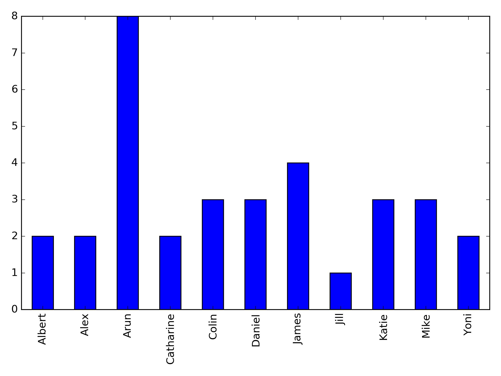

# frydomics
A journal club for -omicsy things @ UCLA. Send me a paper if you'd like to suggest one, otherwise I will choose.

We meet in the sixth floor conference room of [Gonda](https://www.gonda.ucla.edu/) Thursdays at 5:30 for beer and science. If you're reading this, feel free to stop by.

We are modeled after Jeff Ross-Ibarra's [REHAB](http://www.rilab.org/rehab.html), please check there for information on the format. In short, no one presents the paper and we jump in as soon as the beer arrives.

We have a mailing list [here](https://groups.google.com/forum/#!forum/frydomics). Feel free to join or email me (firstname.lastname@gmail.com) for paper annoucements.

Here's some data on who's suggesting papers:

# Papers:

## January

January 17th, 2019

January 31st, 2019

## 2018

### May
May 11th, 2018 [Matz et al 2018](http://journals.plos.org/plosgenetics/article?id=10.1371/journal.pgen.1007220) Potential and limits for rapid genetic adaptation to warming in a Great Barrier Reef coral [blame Katie]

May 4th, 2018 [Veeramah et al 2018](http://www.pnas.org/content/early/2018/03/06/1719880115) Population genomic analysis of elongated skulls reveals extensive female-biased immigration in Early Medieval Bavaria [blame Katie]

### April
April 27th, 2018 [Small et al 2018](https://www.nature.com/articles/s41588-018-0088-x) Regulatory variants at KLF14 influence type 2 diabetes risk via a female-specific effect on adipocyte size and body composition [blame Katie]

April 20th, 2018 [Kremling et al 2018](https://www.nature.com/articles/nature25966) Dysregulation of expression correlates with rare-allele burden and fitness loss in maize [blame Arun]

April 13th, 2018 [Chen et al 2018](https://www.nature.com/articles/s41467-017-00901-0) The microbiota continuum along the female reproductive tract and its relation to uterine-related diseases [blame Katie]

### March

March 16th, 2018 [Alpert Sugden et al 2018](https://www.nature.com/articles/s41467-018-03100-7) Localization of adaptive variants in human genomes using averaged one-dependence estimation [blame Daniel]

March 9th, 2018 [Danko et al 2018](https://www.nature.com/articles/s41559-017-0447-5) Dynamic evolution of regulatory element ensembles in primate CD4+ T cells [blame Arun]

March 2nd, 2018 No journal club -- go to [UCLA Computational Genomics Winter Institute](http://computationalgenomics.bioinformatics.ucla.edu) instead.

### February
February 23rd, 2018 [Lake et al 2018](https://www.nature.com/articles/nbt.4038) Integrative single-cell analysis of transcriptional and epigenetic states in the human adult brain [blame Jill]

February 9th, 2018 [Combs et al 2017](http://onlinelibrary.wiley.com/doi/10.1111/mec.14437/abstract) Spatial population genomics of the brown rat (_Rattus norvegicus_) in New York City [blame Katie]

February 2nd, 2018 [Kong et al 2018](http://science.sciencemag.org/content/359/6374/424.full) The nature of nurture: Effects of parental genotypes [blame Yoni]

### January
January 26th, 2018 [Hernandez et al 2017](https://www.biorxiv.org/content/early/2017/12/15/219238) Singleton Variants Dominate the Genetic Architecture of Human Gene Expression [blame Arun]

January 12th, 2018 [Mumbach, Satpathy, Boyle and Dai et al 2017](https://www.nature.com/articles/ng.3963) Enhancer connectome in primary human cells identifies target genes of disease-associated DNA elements [blame Mike]

## 2017

### December
December 8th, 2017 [Houshdaran et al 2016](https://academic.oup.com/biolreprod/article/95/5/93,%201-16/2883425) Aberrant Endometrial DNA Methylome and Associated Gene Expression in Women with Endometriosis [blame Katie]

### November
November 17th, 2017 [Angermueller et al 2017](https://genomebiology.biomedcentral.com/articles/10.1186/s13059-017-1189-z) DeepCpG: accurate prediction of single-cell DNA methylation states using deep learning [blame Colin]

November 3rd, 2017 [Raj et al 2017](https://www.biorxiv.org/content/early/2017/08/10/174565) Integrative analyses of splicing in the aging brain: role in susceptibility to Alzheimer's Disease [blame Yoni]

### October
October 27th, 2017 [Ongen et al 2017.](https://www.nature.com/ng/journal/vaop/ncurrent/full/ng.3981.html) Estimating the causal tissues for complex traits and diseases [blame Arun]

October 20th, 2017 [He et al 2017.](http://www.cell.com/ajhg/fulltext/S0002-9297(17)30289-6) Unified Sequence-Based Association Tests Allowing for Multiple Functional Annotations and Meta-analysis of Noncoding Variation in Metabochip Data [blame Albert]

October 13th, 2017 [Weissensteiner et al 2017.](http://genome.cshlp.org/content/27/5/697) Combination of short-read, long-read, and optical mapping assemblies reveals large-scale tandem repeat arrays with population genetic implications [blame Daniel]

October 6th, 2017 [Rubin, Barajas, and Furlan-Magaril et al 2017.](https://www.nature.com/ng/journal/vaop/ncurrent/full/ng.3935.html) Lineage-specific dynamic and pre-established enhancer–promoter contacts cooperate in terminal differentiation [blame James]

### September
September 29th, 2017 [Lareau and Aryee 2017.](https://www.biorxiv.org/content/early/2016/12/24/087338) diffloop: a computational framework for identifying and analyzing differential DNA loops from sequencing data [blame Katie]

September 21st, 2017 [Castel et al 2017.](http://www.biorxiv.org/content/early/2017/09/18/190397) Modified penetrance of coding variants by cis-regulatory variation shapes human traits [blame James]

September 15th, 2017 [Mostafavi et al 2017.](http://journals.plos.org/plosbiology/article?id=10.1371/journal.pbio.2002458) Identifying genetic variants that affect viability in large cohorts [blame Arun]

### August
August 4th, 2017 [Cortes and Dendrou et al 2017.](https://www.nature.com/ng/journal/vaop/ncurrent/full/ng.3926.html) Bayesian analysis of genetic association across tree-structured routine healthcare data in the UK Biobank [blame Colin]

### July
No journal club -- go to [UCLA Computational Genomics Summer Institute](http://computationalgenomics.bioinformatics.ucla.edu) instead.

### June
June 30th, 2017 [Hammerschlag et al 2017.](http://www.nature.com/ng/journal/vaop/ncurrent/full/ng.3888.html) Genome-wide association analysis of insomnia complaints identifies risk genes and genetic overlap with psychiatric and metabolic traits [blame Albert]

June 23rd, 2017 [Boyle et al 2017.](http://www.sciencedirect.com/science/article/pii/S0092867417306293) An Expanded View of Complex Traits: From Polygenic to Omnigenic [blame Catharine, James, Arun]

- Bonus: [Goldstein 2009.](http://www.nejm.org/doi/full/10.1056/NEJMp0806284) Common Genetic Variation and Human Traits [blame James, Arun]
- Bonus: [Rockman 2012.](http://onlinelibrary.wiley.com/doi/10.1111/j.1558-5646.2011.01486.x/abstract) The QTN program and the alleles that matter for evolution: all that's gold does not glitter [blame Arun]

June 16th, 2017 [McLaughlin et al 2017.](http://www.nature.com/articles/ncomms14774) Genetic correlation between amyotrophic lateral sclerosis and schizophrenia [blame Alex]

June 9th, 2017 [Glodzik et al 2017.](http://www.nature.com/ng/journal/v49/n3/abs/ng.3771.html) A somatic-mutational process recurrently duplicates germline susceptibility loci and tissue-specific super-enhancers in breast cancers [blame Mike]

June 2nd, 2017 [Knouse et al 2016.](http://genome.cshlp.org/content/26/3/376) Assessment of megabase-scale somatic copy number variation using single cell sequencing [blame Daniel]

### May

May 25th, 2017 [Mathieson et al 2015.](https://www.nature.com/nature/journal/v528/n7583/full/nature16152.html) Genome-wide patterns of selection in 230 ancient Eurasians [blame Arun] **Note: date change**

May 19th, 2017 No journal club -- go to Brewin' Talks!

May 12th, 2017 [Pala and Zappala et al 2017.](http://www.nature.com/ng/journal/vaop/ncurrent/full/ng.3840.html) Population- and individual-specific regulatory variation in Sardinia [blame Arun]

May 5th, 2017 [Corces et al 2017.](https://www.nature.com/ng/journal/v48/n10/full/ng.3646.html) Lineage-specific and single-cell chromatin accessibility charts human hematopoiesis and leukemia evolution [blame Mike]

### April

April 28th, 2017 [Saleheen & Natarajan et al 2017.](https://www.nature.com/nature/journal/v544/n7649/full/nature22034.html) Human knockouts and phenotypic analysis in a cohort with a high rate of consanguinity [blame Alex]

April 21st, 2017 [Yue et al 2017.](http://www.nature.com/ng/journal/vaop/ncurrent/full/ng.3847.html) Contrasting evolutionary genome dynamics between domesticated and wild yeasts [blame James]

April 14th, 2017: [Chiang et al 2017.](http://www.nature.com/ng/journal/vaop/ncurrent/full/ng.3834.html) The impact of structural variation on human gene expression [blame Colin]

April 7th, 2017: [Poplin et al 2016.](http://biorxiv.org/content/early/2016/12/21/092890) Creating a universal SNP and small indel variant caller with deep neural networks [blame Arun]
